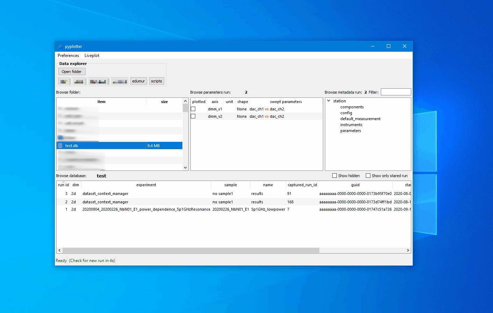

# pyplotter

[](https://opensource.org/licenses/MIT)
[](https://www.python.org/downloads/)
[](https://qcodes.github.io/Qcodes/)
[](https://pypi.org/project/PyQt5/)
[](https://github.com/pyplotter/pyplotter/issues)
[](https://github.com/pyplotter/pyplotter/stargazers)
[](https://github.com/pyplotter/pyplotter/network)

A data browser and vizualizer for QCoDes database, csv, s2p and BlueFors logging files. The purpose of the plotter is to make data exploration as simple and fast as possible. You should never waste time to plot some raw, do some simple fit, ... and that's why the plotter do it for you.


## ✨ Key Features

- **Multiple data formats**: QCoDeS databases, CSV, s2p, and BlueFors logs
- **Live plotting**: Monitor experiments in real-time as data is acquired
- **Interactive analysis**: Built-in filtering, fitting, and data manipulation tools
- **1D and 2D plotting**: Comprehensive visualization with slicing capabilities
- **Fast rendering**: Powered by pyqtgraph for responsive, high-performance plotting
- **Metadata search**: Quickly find parameters in QCoDeS metadata
- **Run management**: Star important runs and hide unsuccessful ones
## 📋 Table of Contents

- [Installation](#installation)
- [Quick Start](#quick-start)
- [Features](#features)
- [Troubleshooting](#troubleshooting)
- [Contributing](#contributing)
- [License](#license)
- [Acknowledgments](#acknowledgments)

## 🚀 Installation

### Prerequisites

Python 3.11 is recommended. The following packages are required:

**Core dependencies:**
- qdarkstyle
- lmfit
- multiprocess
- numpy >= 1.17.0
- pandas >= 1.0.0
- platformdirs
- pyopengl
- pyqt5
- pyqt5-sip
- pyqtwebengine
- pyqtgraph >= 0.12.3
- qcodes >= 0.26.0
- scikit-rf
- scipy

**Optional dependencies:**
- pylabrad (for Labrad data support)

### Recommended Installation

Some users have reported PyQt-related issues when installing pyplotter in a general conda environment. To avoid these issues, we recommend creating a dedicated conda environment:

```bash
# Create and activate a dedicated environment
conda create --name pyplotter python=3.11
conda activate pyplotter

# Install pyqtgraph via conda
conda install pyqtgraph

# Clone and install pyplotter
git clone https://github.com/pyplotter/pyplotter
cd pyplotter
pip install .
```

### Development Installation

For developers who want to modify or debug pyplotter:

```bash
# Create and activate a dedicated environment
conda create --name pyplotter python=3.11
conda activate pyplotter

# Install pyqtgraph via conda
conda install pyqtgraph

# Clone and install pyplotter
git clone https://github.com/pyplotter/pyplotter
cd pyplotter
pip install -e .
```

### Labrad Support (Optional)

Pyplotter can access Labrad data in two ways:

1. **Local file access (SWMR mode)**: Read HDF5 files directly
   - ⚠️ **Warning**: Unstable if files are actively being written. Only read datasets not in active use.

2. **RPC protocol**: Connect to the Labrad datavault server
   - ✅ **Recommended** for live plotting—pyplotter acts as a standard Labrad client

**Note**: Non-Labrad users are unaffected even without pylabrad installed.

**Labrad Grapher layout**: To mimic the two-column layout of Labrad Grapher, modify `ui/mainWindow.py`:
```python
# from .mainWindowui import Ui_MainWindow
from .mainWindowui_r2c2 import Ui_MainWindow
```

## 🎯 Quick Start

### Launching Pyplotter


**Method 1** (Terminal): Open a terminal and run:
```bash
plotter
```

**Windows Shortcut** (Optional): Create a shortcut with the following target:
```
%windir%\System32\WindowsPowerShell\v1.0\powershell.exe -ExecutionPolicy ByPass -NoExit -Command "& 'C:\Users\YOUR_USERNAME\Anaconda3\shell\condabin\conda-hook.ps1' ; conda activate 'C:\Users\YOUR_USERNAME\Anaconda3'; conda activate pyplotter; plotter"
```
*(Replace `YOUR_USERNAME` with your actual username)*

### Interface Tips

- **Single-click** to open folders, databases, and files (no double-clicking required)
- Use keyboard shortcuts: **S** to star a run, **H** to hide a run

## 🛠️ Features

### Main Window

The main window provides a file browser interface for navigating and opening data:


**Supported data sources:**
- QCoDeS databases
- CSV files
- S2P files
- BlueFors log folders

### Working with QCoDeS Databases

When you select a QCoDeS database, all runs and metadata are displayed:


Click on any run to view its dependent parameters and station configuration:


### Data Export

Quickly export run data directly from the main window with a left-click:



### 1D Plotting

Select dependent parameters to plot by checking the corresponding boxes:


**Multiple parameters**: Plot multiple dependent parameters from the same run simultaneously:


#### Interactive 1D Analysis

Pyplotter provides powerful interactive tools for data analysis:

**Filtering**: Apply filters like Savitzky-Golay smoothing
1. Select the curve in the "Select curve" group box
2. Choose the data range for the interaction
3. Click the desired filter (e.g., "Savitzky-Golay")


**Fitting**: Multiple fitting models are available for curve analysis:


### 2D Plotting

Create heatmaps and 2D visualizations by selecting 2D dependent parameters:


#### Interactive 2D Analysis

**Slicing**: Extract 1D line cuts from 2D data. The resulting 1D plots have full interactivity (filtering, fitting, etc.):


### Run Organization

**Starring runs**: Mark important runs with a star by selecting them and pressing **S**

**Hiding runs**: Hide unsuccessful or test runs by selecting them and pressing **H**

Hidden runs can be revealed by clicking "Show hidden"

This system helps organize your data but doesn't replace proper lab notebook documentation.


### Metadata Filtering

QCoDeS saves comprehensive metadata for every run. To quickly find specific parameters, use the filter text field to search through the metadata:


### Live Plot Mode

Monitor experiments in real-time as data is acquired:

1. Select a QCoDeS database
2. Enable the "livePlot" checkbox
3. New runs will automatically appear as 1D or 2D plots


### Multi-Run Comparison

Compare data from different runs on the same plot:

When two or more curves are plotted, an "Add curves" tab appears, allowing you to overlay data from different runs for direct comparison.

## ⚠️ Troubleshooting

### QCoDeS Version Compatibility

**Problem**: QCoDeS ensures backward but not forward compatibility. If you try to open a database created with a newer version of QCoDeS than you have installed, you may encounter errors like:

```python
KeyError: 2
```

**Solution**: Update QCoDeS to the latest version:
```bash
pip install --upgrade qcodes
```

**Explanation**: A database created with QCoDeS version *i* can only be read by QCoDeS version *j* where *j* ≥ *i*.

### PyQt Issues

**Problem**: Various PyQt-related errors when running pyplotter.

**Solution**: Use a dedicated conda environment (see [Installation](#installation)).

## 🤝 Contributing

Contributions are welcome! Please feel free to submit issues or pull requests on [GitHub](https://github.com/pyplotter/pyplotter).

## 👷 Authors

- **Etienne Dumur** - *Main developer* - [etienne.dumur@cea.fr](mailto:etienne.dumur@cea.fr)
- **Liang Xiang** - *Labrad support* - [xlelephant@gmail.com](mailto:xlelephant@gmail.com)

## 📄 License

This project is licensed under the MIT License.

## 🙏 Acknowledgments

- [plottr](https://github.com/toolsforexperiments/plottr) - Inspiration for interface design
- [pyqtgraph](http://www.pyqtgraph.org/) - Fast and powerful plotting library
- [bokeh](https://github.com/bokeh/bokeh) - Colormap palettes
- [qbstyles](https://github.com/quantumblacklabs/qbstyles) - Line color schemes
- [Labrad Grapher](https://github.com/labrad/labrad-manager-delphi/tree/master/Grapher) - Two-column layout design

---

**Questions or feedback?** Open an issue on [GitHub](https://github.com/pyplotter/pyplotter/issues) or contact the authors directly.