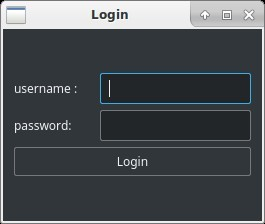
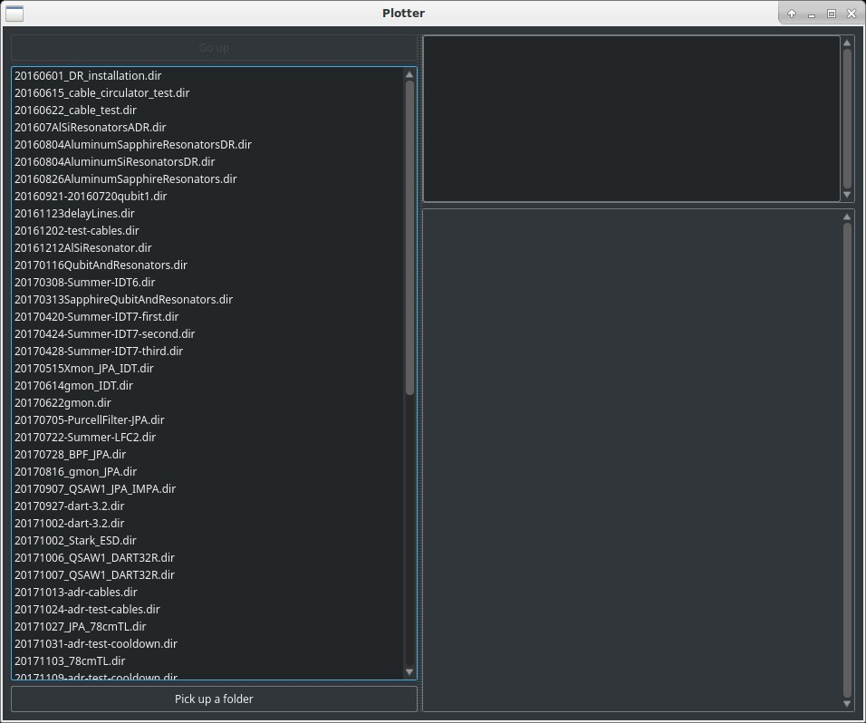
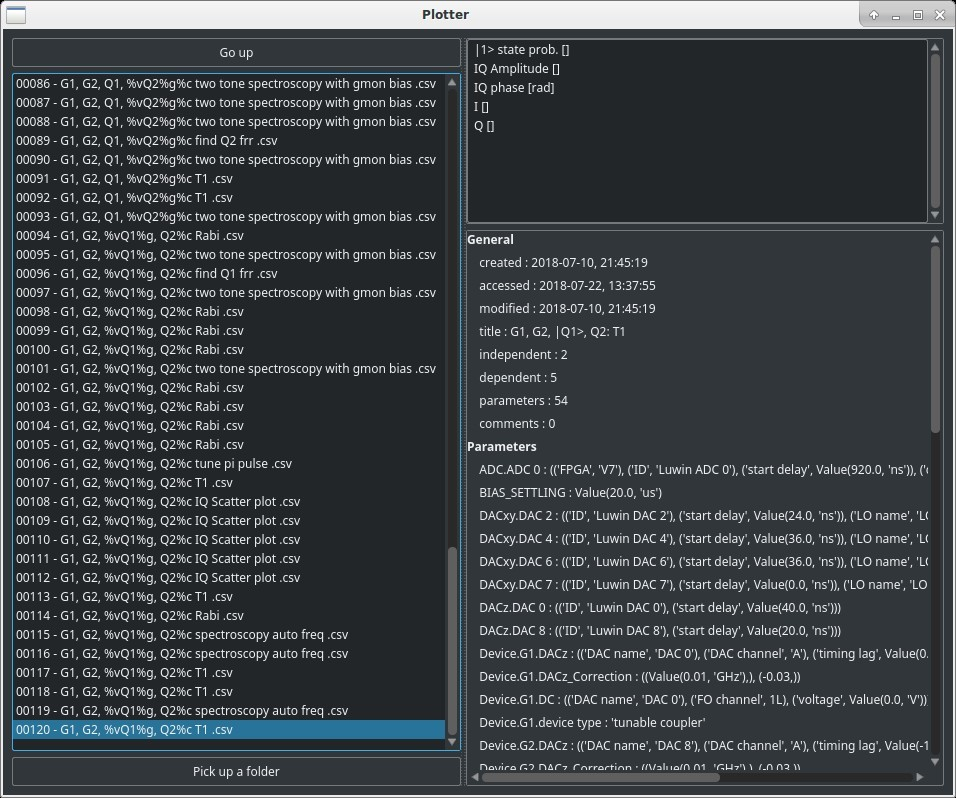
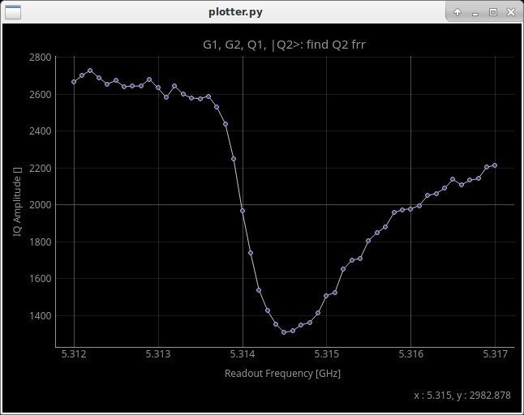
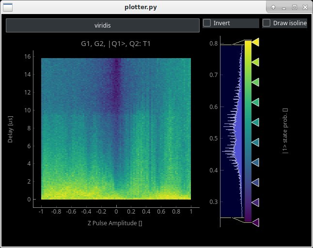
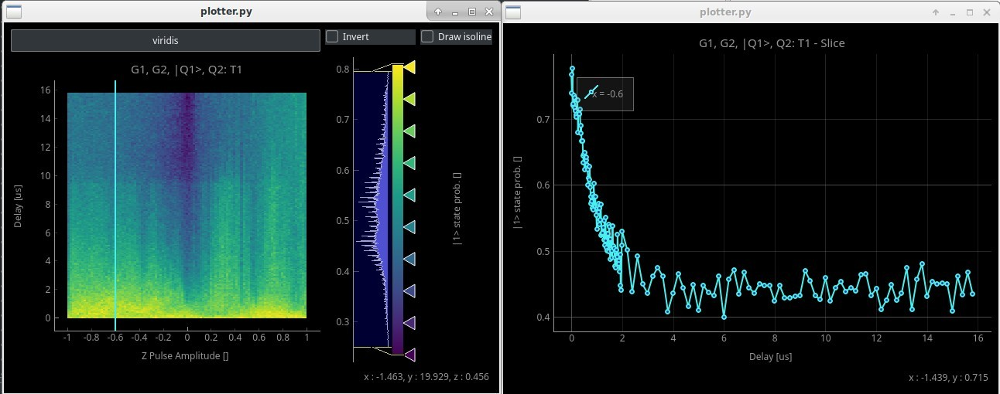
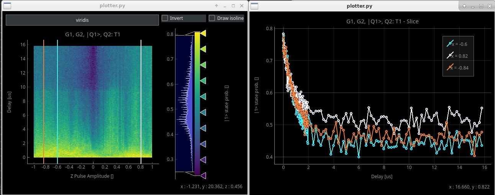
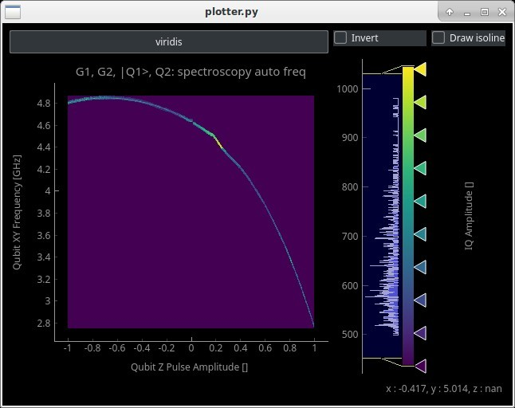

# Plotter

A data vizualizer of Labrad data format which does not require labrad to run.

## Getting Started

Simply launch the plotter.py file to launch the software:
```
python plotter.py
```

The script will then ask your username and password to access to Varys.


Once the connection is effective you have access to the main window


Every interaction is one left click from the mouse.
Once a data file is selected, you have access to the possible data plot, top right, and the meta information, bottom right:


To plot some data, just left click once on any data line on the top right panel
Depending of the number of dimension the software will plot a 1d plot

or a 2d one


In both cases the cursor is replaced by a crosshair when the mouse is hover a plot. The mouse coordinates are displayed at the bottom right of the window. The user can zoom in and our with the wheel and scale with the right click.
There is no limit to how many plot window you can open at the same time but at some point I guess your computer will suffer.

There are interactions only possible with 2d plots. The user can change the colormap by clicking the colormap button on the top left, invert the colormap by cheking the checkbox "invert" and modify the colormap limits with the histogram on the right.

It is also possible to plot an "isocurve" which will enhance the value chosed on the colormap histogram, 0.6 is chosen as example below:

The isoline is fully interactive and user can drag the line on the histogram to change the value.

User can also plot a slice of a 2d plot by double clicking on it:

Again the slice is fully interactive and user can drag then and observe the slice changing on the other window.
There are no limit for the number of possible slices:


The software handle no sorted and incomplete data as for example a spectroscopy auto freq



## Installing

The easiest way is to clone the repository

```
git clone https://gitlab.com/clelandlab/plotter
```


### Windows

For windows user I recommend to use Anaconda and/or pip.

Through Anaconda install pyqtgraph, pandas and matplotlib:
```
conda install pyqtgraph pandas matplotlib
```

A package needed is not available in conda and can be found in pip:
```
pip install pysmb
```
Another package not in conda that needs to be installed if you don't already have it is lmfit:
```
pip install lmfit
```
Since the installation has been done through anaconda, you have to launch the plotter through an anaconda terminal.

#### Linux

For Linux user repo packages and/or pip should be enough.
Pyqtgraph had to be install manually on my linux distribution to get a recent version.

## Authors

* **Etienne Dumur**


## License

Surely free but I have to chose one.

## Acknowledgments

* For the 4h of hot NMP that you have to wait when doing fab. That gave me free time to write the first version of the plotter.